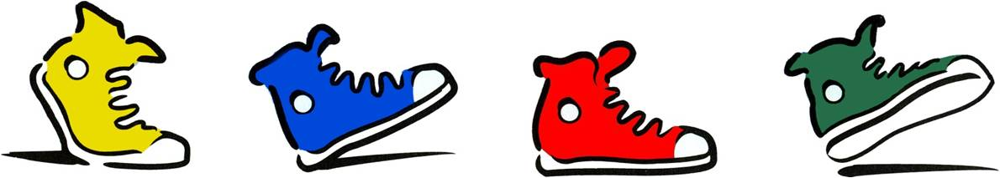

# CityPulse docs

Welcome to CityPulse, which provides customized walking routes for pedestrians.

Welcome to our documentation. If you're looking for the code, go to our [GitHub repo](https://github.com/bongiovimatthew-microsoft/pedestrian-map-seattle).

## Contents
1. [What is CityPulse?](./docs/what-is-citypulse.md)

2. [How CityPulse works](./docs/how-citypulse-works.md)

3. [How to contribute](./docs/how-to-contribute.md)

4. [Compile and run CityPulse](./docs/compile-and-run-citypulse.md)

5. [Backend architecture](./docs/backend-architecture.md)

6. [How to create your own cleaner](./docs/create-your-own-cleaner.md)

7. [Data review process for new cleaners](./docs/data-review-process-for-new-cleaners.md)

8. [Current data knob definitions](./docs/data-knob-definitions.md)