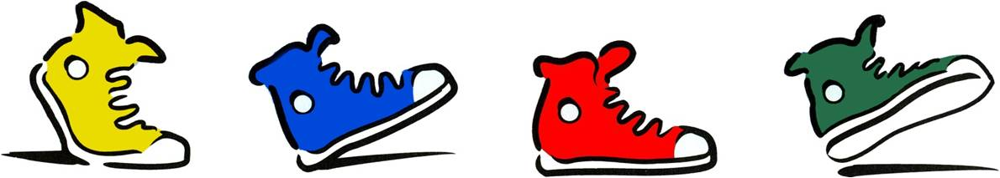

# CityPulse docs

Welcome to CityPulse, which provides customized walking routes for pedestrians.

Welcome to our documentation. If you're looking for the code, go to our [GitHub repo](https://github.com/bongiovimatthew-microsoft/pedestrian-map-seattle).

## Contents
1. [What is CityPulse?](what-is-citypulse.md)

2. [How CityPulse works](how-citypulse-works.md)

3. [How to contribute](how-to-contribute.md)

4. [Compile and run CityPulse](compile-and-run-citypulse.md)

5. [Backend architecture](backend-architecture.md)

6. [How to create your own cleaner](create-your-own-cleaner.md)

7. [Data review process for new cleaners](data-review-process-for-new-cleaners.md)

8. [Current data knob definitions](data-knob-definitions.md)